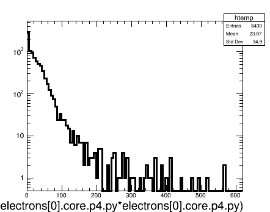

[]() FCC Pythia + Delphes + Heppy Analysis
==========================================================

-   [Overview](#overview)
-   [Generate and Simulate Events](#generate-events)
-   [Analyze Events](#analyze-events)
-   [Plot events](#plot-events)
-   [Homework exercise](#homework-exercise)


[]()Part 0: Overview
---------------------


This tutorial will teach you how to:

-   **generate** signal and background samples with **Pythia8** within FCCSW
-   run a fast parametric **detector simulation** with **Delphes** within FCCSW
-   apply an **event selection** on those samples with **Heppy**
-   produce **flat ntuples** with observables of interest with Heppy
-   produce plots


[]()Part I: Generate and simulate Events with FCCSW
----------------------------------------------------

First, log into lxplus, and **install the FCC software**:

``` {style="padding-left: 30px;"}
git clone git@github.com:HEP-FCC/FCCSW.git
cd FCCSW
source ./init.sh
make -j 12
```

For this tutorial we will consider the following **physics processes**: 

-   p p -> H -> 4 l
-   p p -> Z/gamma Z/gamma -> 4 l 

Pythia can be configured to hadronize previously generated hard scattering in the form of Les Houches event files (.lhe),
or generate the hard process itself and then run the parton shower and hadronization. **In either case, the FCCSW takes
as input a Pythia8 configuration file** (.cmd), and does not need to know which approach was used.

The following commands will run Pythia8 and Delphes and produce the relevant signal and background samples:

``` {style="padding-left: 30px;"}
./run fccrun.py Sim/SimDelphesInterface/options/PythiaDelphes_config.py --inputfile=Generation/data/Pythia_pp_h_4l.cmd --outputfile=pp_h_4l.root --nevents=1000
./run fccrun.py Sim/SimDelphesInterface/options/PythiaDelphes_config.py --inputfile=Generation/data/Pythia_pp_zgzg_4l.cmd --outputfile=pp_zgzg_4l.root --nevents=1000
```

The `--inputfile` , `--outputfile` and `--nevents` options simply overwrite parameters that are defined in the main
configuration `Sim/SimDelphesInterface/options/PythiaDelphes_config.py`. For a complete discussion on the structure of configuration file, see [this page](https://github.com/HEP-FCC/fcc-tutorials/blob/master/FccPythiaDelphes.md). 
Aside from I/O and number of events (which can be specified through command line), 
for most use cases as a user you won't need to apply any change to the configuration file. 

In additon to the **workflow**, and which **output collections** to be stored in the output tree, the following
parameters can be specified via the configuration file:

-   `             nEvents           ` --&gt; number 
    of events to be simulated
-   `             pythiaConfFile           ` --&gt; 
    Pythia8 configuration file
-   `             delphesCard           ` --&gt; 
    Delphes detector card
-   `             out.filename           ` --&gt; 
    name of output file

In this example, Delphes is run on the fly with the baseline FCC-hh detector configuration. 
Other detector cards can be found in the ```$DELPHES_DIR/cards``` directory, such as a ATLAS, CMS or ILD detector configurations: 
```delphes_card_ATLAS.tcl```, ```delphes_card_CMS.tcl``` and  ```delphes_card_ILD.tcl```. Many of the questions you might have on Delphes Fast Simulation are probably answered
[here](https://cp3.irmp.ucl.ac.be/projects/delphes/wiki/WorkBook).

Now overwrite the samples you just produced, with larger samples (10k events) that have been previously produced and stored in eos.

``` {style="padding-left: 30px;"}
export EOS_MGM_URL="root://eospublic.cern.ch"
source /afs/cern.ch/project/eos/installation/client/etc/setup.sh
eos cp /eos/fcc/hh/tutorials/Higgs_4l/pp_h_4l.root .
eos cp /eos/fcc/hh/tutorials/Higgs_4l/pp_zgzg_4l.root .
```

The output is a ROOT file containing a tree in the FCC [Event Data Model structure](https://github.com/HEP-FCC/fcc-edm). It is browsable with ROOT:

``` {style="padding-left: 30px;"}
root -l pp_h_4l.root 
TBrowser t;
```

Plotting some basic quantities directly on this output is possible, although not very handy:

``` {style="padding-left: 30px;"}
events->Draw("sqrt(electrons[0].core.p4.px*electrons[0].core.p4.px + electrons[0].core.p4.py*electrons[0].core.p4.py)")
gPad->SetLogy()
```

<!--  -->


[]()Part II: Analyze the output with Heppy
------------------------------------------


[Heppy](https://github.com/cbernet/heppy) is a python framework suitable for analyzing the FCCSW output.

First install HEPPY:

``` {style="padding-left: 30px;"}
git clone git@github.com:cbernet/heppy.git
cd heppy
source init.sh
cd ..
```
 
Understand the configuration file for this **H->4l analysis**: `heppy/test/analysis_pp_hTo4l_simple_cfg.py`
This is where **filters** on input collections and **event selection** are defined.
The sequence is divided in two parts, a gen level analysis, and a reco level. 

-   The **gen level analysis** simply filters interesting leptons (`gen_leptons`) and stores pT, eta in in flat tree (`gen_tree`).

Have a look at the corresponding code in `heppy/analyzers/examples/hzz4l/HTo4lGenTreeProducer.py`.

-   The **reco level analysis** first **selects isolated leptons** (`selected_muons`, `selected_electrons`), merges them into a single collection (`selected_leptons`),
**builds Z candidates** (`zeds`) and finally **builds higgs candidates**  (`higgses`). After that an **event selection** is applied (`selection`).

Open `heppy/analyzers/examples/hzz4l/selection.py` and understand the event selection. 

Finally another flat tree is produced `HTo4lTreeProducer`.
This tree contains contains all relevant information for the two reconstructed Z bosons, the Higgs, and the four associated leptons. 
For comparison, also the MC level counterparts of the reconstructed quantities are stored. 

To summarize, when designing a new analysis, you will have to define:

- a configuration file containing the analysis sequence
- an event selection
- one or several tree producer(s) where the variables to be stored in the output tree(s) are specified
- optionally, new modules that are specific to your analysis (e.g. `LeptonicZedBuilder` here)

Now run HEPPY:

``` {style="padding-left: 30px;"}
heppy_loop.py pp_h_4l heppy/test/analysis_pp_hTo4l_simple_cfg.py -N 10000 -I pp_h_4l.root;
heppy_loop.py pp_zgzg_4l heppy/test/analysis_pp_hTo4l_simple_cfg.py -N 10000 -I pp_zgzg_4l.root;
```
The runs create two output directories `pp_h_4l` and `pp_zgzg_4l`, with various subdirectories. The breakdown of
efficiencies by cut can be found in:

`example/heppy.analyzers.examples.hzz4l.selection.Selection_cuts/cut_flow.txt`

The **gen-level** and **reco-level** output trees can be found here:

`example/heppy.analyzers.examples.hzz4l.HTo4lGenTreeProducer.HTo4lGenTreeProducer_1/tree.root`
`example/heppy.analyzers.examples.hzz4l.HTo4lTreeProducer.HTo4lTreeProducer_1/tree.root`


[]()Part IV: Produce plots
-----------------------

Download the python code:

``` {style="padding-left: 30px;"}
git clone git@github.com:selvaggi/tutorials.git
```

Produce Gen-level plots:

``` {style="padding-left: 30px;"}
python tutorials/fcc/createGenHistos.py
eog plots/lep*.png
```


Produce Reco-level plots:

``` {style="padding-left: 30px;"}
python tutorials/fcc/createRecoHistos.py
eog plots/*_m.png
```

Appreciate the signal yield for **25 fb-1 of data**. Compare with [ATLAS results](https://arxiv.org/pdf/1408.5191v3.pdf) at 7,8 TeV .


[]()Part V: Homework
---------------------

As an exercise you can **re-run the full analysis with the CMS detector configuration**. You should obtain a plot similar to the following:


By comparing the CMS and FCC Delphes cards, try to explain:

-  the **event yields difference between 7/8 TeV and 100 TeV** (by comparing the official ATLAS plot with the CMS configuration you just ran at 100 TeV)
-  the **event yields difference at 100 TeV** between the CMS and FCC detector configurations
-  the **difference in the width of Z and H peaks** between the CMS and FCC detector configurations


[]() Other documentation
------------------------

-   [Submit FCCSW jobs using the condor queue](https://github.com/HEP-FCC/fcc-tutorials/blob/master/FccCondor.md)
-   [Submit Heppy jobs using the batch queue](https://github.com/HEP-FCC/heppy/blob/master/doc/Heppy_-_Parallel_Processing.md)
-   [FCCSW webpage](http://fccsw.web.cern.ch/fccsw/index.html)
-   [Pythia8 manual](http://home.thep.lu.se/~torbjorn/pythia81html/Welcome.html)
-   [Delphes website](https://cp3.irmp.ucl.ac.be/projects/delphes)

------------------------------------------------------------------------


