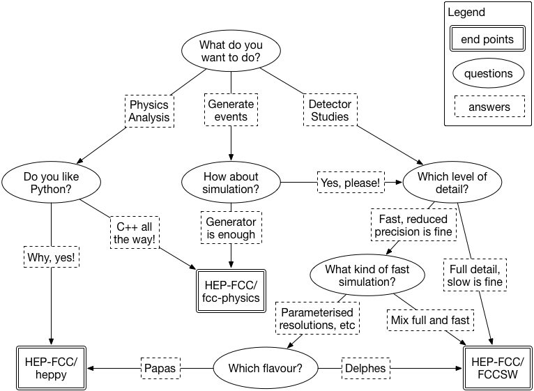

# Getting started with FCC software

The FCC software is the common software for the FCC detector design study. We support the whole chain starting
from event generation through parameterized and full detector simulation, reconstruction and data analysis.

### Prerequisites

You should be familiar with basics of `bash` and know something about either python or C++ programming. If you are not, there are excellent material on the web.

New to CERN? Get to know the lxplus system [here](http://information-technology.web.cern.ch/book/lxplus-service/lxplus-guide/lxplus-aliases), [here](http://information-technology.web.cern.ch/services/lxplus-service), and [here](https://twiki.cern.ch/twiki/bin/view/LHCb/RemoteLxplusConsoleHowTo). Log in with the standard `ssh` command; if you are on Windows, look at [PuTTY](http://www.chiark.greenend.org.uk/~sgtatham/putty/download.html).

> When you plan to contribute, have a look at the [contribution guide](./FccSoftwareGit.md).

## Setting up the FCC environment


The following  will set up the pre-installed software on lxplus (or any centos7 machine with cvmfs):

```bash

source /cvmfs/fcc.cern.ch/sw/latest/setup.sh
```

*Note*: This has to  be done every time you start a new session (i.e. when you log into your machine).

Check the setup by looking for the command `fccrun` to run jobs in the Gaudi-based software framework FCCSW:

```
which fccrun
```


### Alternative setup methods

* The above script should automatically choose the latest installation available.
For productions it is recommended to explicitly choose the version and platform of the software to use, for example by running
```
source /cvmfs/fcc.cern.ch/sw/views/releases/externals/96b.0.0/x86_64-centos7-gcc8-opt/setup.sh
```

Note that the above only sets up the "externals" and not the FCC software framework.
This must be done in another step, running (fox example):
```
/cvmfs/fcc.cern.ch/sw/releases/fccsw/0.11/x86_64-centos7-gcc8-opt/setup.sh
```
Note that the setup.sh script was called `this_fccsw.sh` in older versions of FCCSW . 

* In case you don't have a centos7 installation, but you do have docker, you can use the [centos7 docker image provided by LHCb](https://gitlab.cern.ch/lhcb-core/LbDocker/#usage).
Invoking `lb-docker-run --centos7 --no-lblogin --force-cvmfs` should give you access to the fcc cvmfs installations even if your host machine does not have cvmfs installed.

* In case you want to work offline or need to tweak something deep in the stack, take a look at this repository of [FCC packages for Ubuntu ](https://fcc-pileup.web.cern.ch/fcc-pileup/sw/fcc-ubuntu-sw.html).


<!--  -->

## Where do I start?

That of course depends on what you want to do:

### Produce and analyse fast-simulated events:

- [Getting started with the production and analysis of fast-simulated events](FccSoftwareGettingStartedFastSim.md)
    - [Getting started with papas (FCC\-ee)](FccSoftwareGettingStartedFastSim.md#getting-started-with-papas-fcc-ee)
    - [Getting started with Delphes (FCC\-hh)](FccSoftwareGettingStartedFastSim.md#getting-started-with-delphes-fcc-hh)

### Develop or use full simulation, reconstruction and detailed detector descriptions:

- [Getting started with FCCSW](./FccSoftwareFramework.md)
- [Geant 4 full (and fast) simulation](https://github.com/HEP-FCC/FCCSW/tree/master/Sim/doc/README.md)
- [Getting started with detector description](https://github.com/HEP-FCC/FCCSW/tree/master/Detector/doc/DD4hepInFCCSW.md)
- Reconstruction
    - [Information about calorimeter reconstruction](https://github.com/HEP-FCC/FCCSW/tree/master/Reconstruction/doc/RecCalorimeter.md)
    - [Information about track reconstruction](https://acts.web.cern.ch)
- For information about using Delphes, see the [FCC-hh example](FccSoftwareGettingStartedFastSim.md#getting-started-with-delphes-fcc-hh) mentioned above

Additional information is to be found in the [index](README.md)
 
## Where do I find more information?

Depending on what you want to do, there are three different repositories that are your entry point in the FCC software stack.

The [tutorials overview](http://fccsw.web.cern.ch/fccsw/tutorials) has links to further reading material grouped by repository.

The following panels should help you identify where to look for more:

### Look at [heppy & fcc-physics](http://fccsw.web.cern.ch/fccsw/tutorials#further-reading) for:

Analysis and fast simulation

- Standalone Pythia event generation
- FCC-ee parametric fast simulation (papas)
- FCC-ee and FCC-hh physics analysis
 
### Look at [FCCSW](http://fccsw.web.cern.ch/fccsw/tutorials#further-reading) for:
 
Event generation, simulation and reconstruction

- Event generation with Pythia (more to come)
- FCC-hh parametric fast simulation (Delphes)
- Full and fast simulation with Geant 4
- Detector descriptions with DD4hep
- Reconstruction algorithms

***

If you encounter problems or have ideas for improving our tutorials, please contact FCC developers  on mattermost, the forum or via mailing-list. Find the links on https://cern.ch/fccsw !
